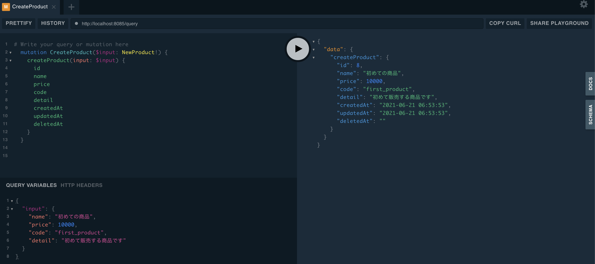
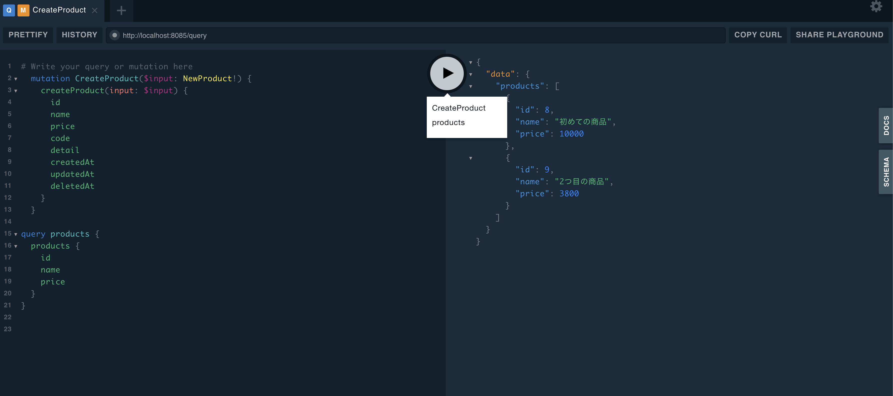

# graphql-server-sample

GraphQL Server のサンプル実装

[gqlgen] を使用して、GraphQL Serverを実装しています。

商品(Product), バリエーション(SKU)をGraphQL APIで登録、更新、削除、検索するサンプルです。

商品情報更新についてはSubscriptionも実装しています。

## 必要なソフトウェア

- Docker
  - Docker version 20.10.6で検証
- docker-compose
  - docker-compose version 1.29.1で検証

## 実行方法

プロジェクトのルートディレクトリーでDocker composeを実行することで立ち上がります。

``` shell
docker-compose up -d
```

http://localhost:8085 にアクセスするとGraphQL Play groundが立ち上ります。



画像の様にPlay groundに _mutation_ や _query_ を記載することが出来ます。
引数を指定したい場合、画面左下の _QUERY VARIABLES_ から引数を設定できます。

商品登録用の _mutation_ のサンプル

``` text
mutation CreateProduct($input: NewProduct!) {
  createProduct(input: $input) {
    id
    name
    price
    code
    detail
    createdAt
    updatedAt
    deletedAt
  }
}
```

引数( _QUERY VARIABLES_ )のサンプル

``` text
{
  "input": {
    "name": "初めての商品",
    "price": 10000,
    "code": "first_product",
    "detail": "初めて販売する商品です" 
  }
}
```



商品情報取得用の _query_ のサンプル

``` text
query products {
  products {
    id
    name
    price
  }
}
```

Play groundに複数の _mutation_ や _query_ を記載した場合、 実行ボタンをクリックすると、どのクエリーを実行するかを選択することが出来ます。
引数は複数保存することが出来ないので、都度変更する必要があります。


### Dockerを使用せずに動かしたい場合

Dockerを使用せずに立ち上げる場合、環境変数に以下の値を設定してください。
値自体はDockerで設定している値をそのまま記載しているだけですので、環境に応じて変更していただいて問題ありません。

| 変数名 | 変数の値(Dockerで指定している値) |
|:------|:--------|
| GRAPHQL_BASEURL | http://localhost:8085 |
| GRAPHQL_DSN | graphql:graphql@tcp(db:3306)/graphql?parseTime=True |
| GRAPHQL_LOGFILE | ./log/app.log |
| GRAPHQL_PORT | 8085 |
| GRAPHQL_SQLLOGLEVEL | Info |

データベースとの接続が必要になりますので、接続できるデータベースを用意して、 _DSN_ を設定してください。
MySQLのドライバーを指定しているので、データベースはMySQL互換のものを準備してください。

## 使用パッケージ

- [gqlgen]
  - GraphQLを構築するためのビルドツール
- [dataloaden]
  - 遅延フェッチを実行する。N+1問題を解決するために利用

## qglgenの使用方法

_gqlgen_ を使用することで、GraphQL用のコードを自動生成することが出来ます。

まず、スキーマ(schema.graphqls)を作成します。

次に、`gqlgen-generate ./...`をserverディレクトリー直下(gqlgen.ymlが置いてあるディレクトリー)で実行します。

スキーマを変更したい場合も同様に、schema.graphqlsを変更後に、`gqlgen-generate ./...`を実行します。

_schema.resolvers.go_ が作成、または変更されますので、未実装の(ガラだけ出来ている)関数を実装していきます。

## dataloadenの使用方法

遅延フェッチ対象を使用したい場合、 _dataloaden_ を使用します。

以下の様なコマンドをserverディレクトリー直下で実行します。

`go run github.com/vektah/dataloaden SkuSliceLoader int []*github.com/tochukaso/graphql-server-sample/graph/Model.Sku`

`SkuSliceLoader`の部分は、dataloadenでジェネレートするクラス名になります。

`int` の部分は、フェッチする際の引数になります。

この場合、productId(int)をキーにskuを取得するので、`int`を指定しています。

`[]*github.com/tochukaso/graphql-server-sample/graph/Model.Sku` の部分は戻り値の部分になります。

- Zシェルを使用している場合、`noglob`をコマンドの先頭につけてください。 _*_ が設定されていることでコマンドが正常に実行されません。
- 1対1の関係の場合、戻り値の型(上記の[]*github...の箇所)は配列にしないでください。
- dataloaders.goに新しく追加されたLoaderの実装を記載して、schema.resolvers.goで呼び出し箇所を実装します。

[gqlgen]: https://github.com/99designs/gqlgen
[dataloaden]: https://github.com/vektah/dataloaden
